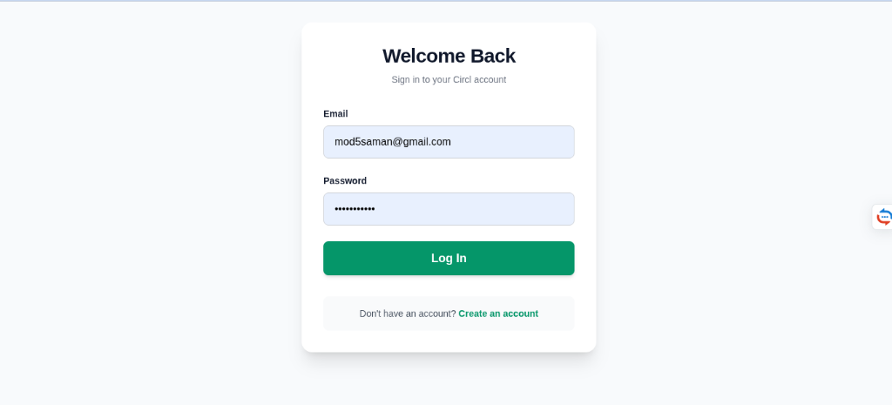
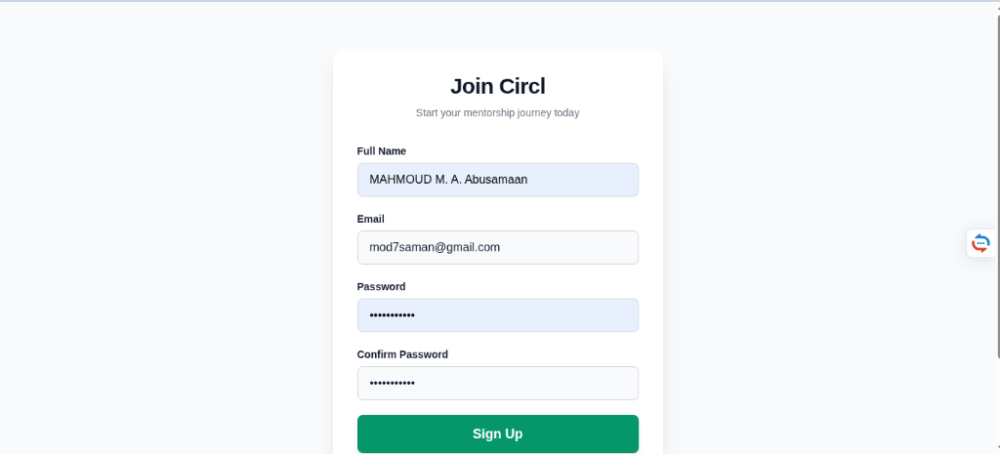
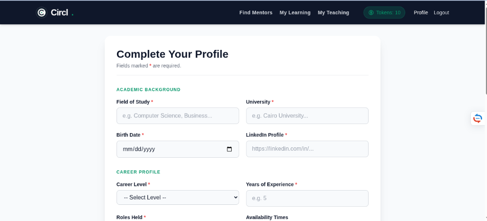
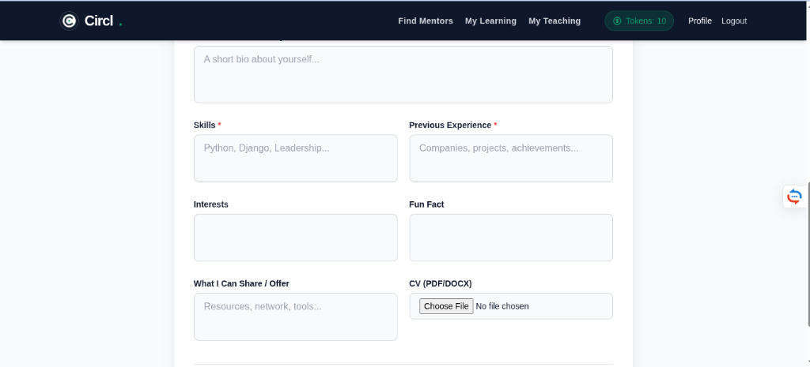
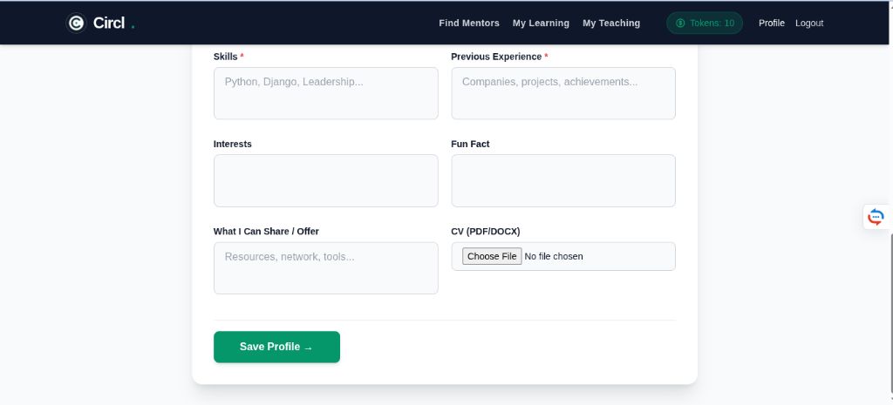
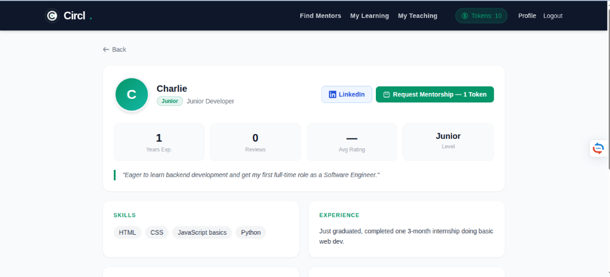

# Circl Mentorship Platform

Circl is a modern, dual-sided mentorship application designed to facilitate knowledge sharing through a structured, token-based economy. Built with a focus on professional growth, it allows users to switch seamlessly between being a mentor and a mentee, ensuring a continuous loop of learning and teaching.

## 🚀 Overview

Circl addresses the challenge of finding quality mentorship by introducing a "pay-it-forward" token system. Users earn tokens by mentoring others and spend them to receive mentorship. This ensures a balanced ecosystem where everyone contributes to the community's growth.

## ✨ Core Features

### 1. Dual-Sided Profiles
Every user on Circl has a comprehensive profile that highlights their:
- **Academic Background:** Field of study and university.
- **Career Profile:** Level of experience, roles held, and years in the field.
- **Skills & Expertise:** A detailed breakdown of technical and soft skills.
- **Vouching System:** Users can share resources, networks, and tools.

### 2. Token Economy
- **Secure Transactions:** Built on an atomic token-based system.
- **Escrow Mechanism:** Tokens are escrowed when a meeting is requested and only transferred upon successful completion.
- **Initial Grant:** New users receive 10 tokens to start their learning journey.

### 3. Smart Discovery
- **Mentor Search:** Find mentors based on skills, roles, and experience.
- **Detailed Mentor Views:** View comprehensive profiles including bios, LinkedIn links, and verified experience before requesting a session.

### 4. Meeting Lifecycle Management
- **Integrated Scheduling:** Uses Calendly links for seamless meeting coordination.
- **Real-Time Updates:** WebSocket-powered notifications for request status (Accepted/Rejected/Completed).
- **Mutual Evaluation:** A granular feedback system where both parties rate various aspects of the profile and the session.

## 📸 Screenshots

### Onboarding & Authentication
<p align="center">
  
  
</p>

### Comprehensive Profile Setup
<p align="center">
  
</p>
<p align="center">
  
</p>
<p align="center">
  
</p>

### Mentor Discovery
<p align="center">
  
</p>

## 🛠 Technology Stack

- **Backend:** [Django 4.2+](https://www.djangoproject.com/)
- **Frontend Logic:** [Jinja2 Templates](https://jinja.palletsprojects.com/)
- **Styling:** [Tailwind CSS](https://tailwindcss.com/)
- **Real-time:** [Django Channels](https://channels.readthedocs.io/) & [WebSockets](https://developer.mozilla.org/en-US/docs/Web/API/WebSockets_API)
- **Database:** SQLite (Development) / PostgreSQL (Production ready)

## 🛠 Installation & Setup

1. **Clone the repository:**
   ```bash
   git clone <repository-url>
   cd solo_project
   ```

2. **Set up a virtual environment:**
   ```bash
   python -m venv venv
   source venv/bin/activate  # On Windows: venv\Scripts\activate
   ```

3. **Install dependencies:**
   ```bash
   pip install -r requirements.txt
   ```

4. **Run migrations:**
   ```bash
   python manage.py migrate
   ```

5. **Initialize Tailwind CSS:**
   ```bash
   python manage.py tailwind install
   python manage.py tailwind start
   ```

6. **Start the development server:**
   ```bash
   python manage.py runserver
   ```

### 🧪 Development Tools & Seeding

The project includes a seeding script to quickly populate the database with a test environment (Mentors, Mentees, Meetings, and Evaluations):

```bash
python seed.py
```

**Test Credentials:**
- **Mentors:** `alice@example.com` / `password123`, `bob@example.com` / `password123`
- **Mentee:** `charlie@example.com` / `password123`
- **Admin:** `admin@example.com` / `password123`

## 📂 Project Structure

- `core/`: Main application logic, including models for Users, Meetings, and Evaluations.
- `solo_project/`: Project configuration, URL routing, and ASGI/WSGI settings.
- `theme/`: Tailwind CSS configuration and assets.
- `media/`: Storage for user-uploaded files like CVs.
- `screenshots/`: Project visuals used in documentation.

---
Built with ❤️ for the mentorship community.
